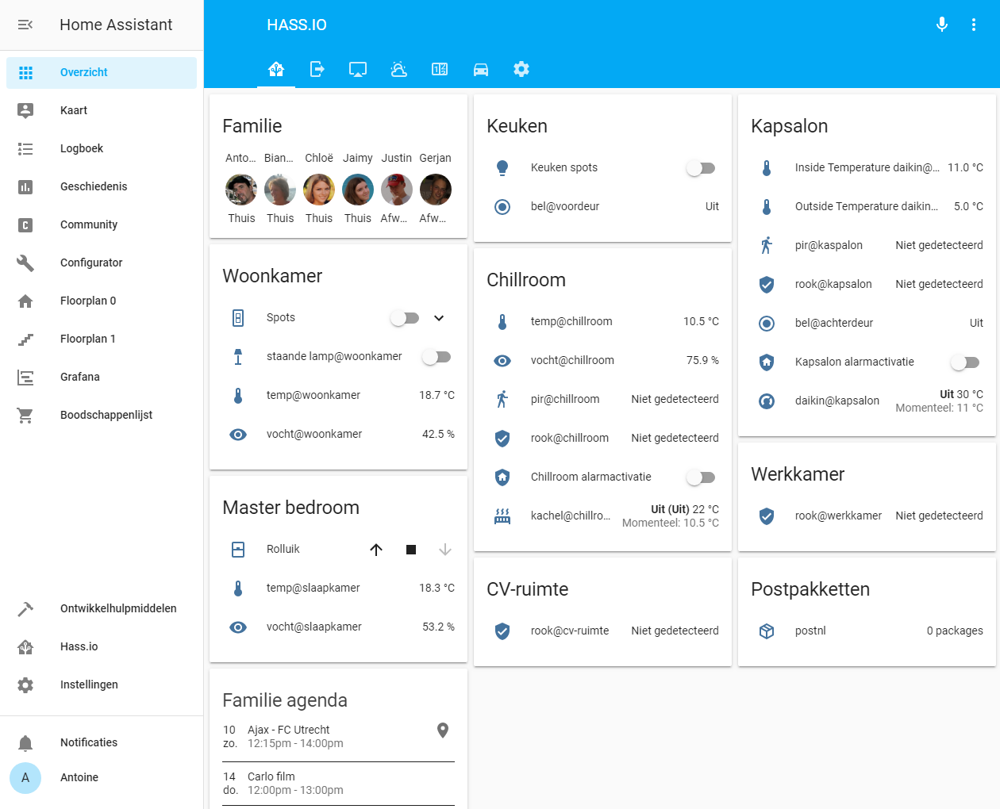

# My Home Assistant Configuration

## About

This is my personal Home Assistant configuration, for sprinklering my garden.

This is my currently sprinkler set of configuration files for my [Home Assistant](https://home-assistant.io) running on Raspberry Pi.
If you are intested in following my progress be sure ⭐️ Star this repository.

--switches.yaml--

# Electro dragon Dual 01
- platform: mqtt
  name: "sprinkler@frontyard"
  command_topic: "cmnd/dragon33/POWER1"
  state_topic: "stat/dragon33/POWER1"
  payload_on: "ON"
  payload_off: "OFF"
  qos: 1
  optimistic: false
  retain: true
  icon: 'mdi:flower'

# Electro dragon Dual 02
- platform: mqtt
  name: "sprinkler@backyard"
  command_topic: "cmnd/dragon33/POWER2"
  state_topic: "stat/dragon33/POWER2"
  payload_on: "ON"
  payload_off: "OFF"
  qos: 1
  optimistic: false
  retain: true
  icon: 'mdi:flower'

# Sprinklertime switch
- platform: template
  switches:
    sprinkler_timer:
      value_template: "{{ is_state('input_boolean.sprinkler_timer', 'on') }}"
      turn_on:
        - service: input_boolean.turn_on
          entity_id: input_boolean.sprinkler_timer

--Sensors.yaml--
# Buienradar
- platform: buienradar
  monitored_conditions:
#     - symbol
#     - humidity
#     - temperature
#     - windspeed
#     - condition
#     - symbol
#     - symbol_1d
#     - symbol_2d
#     - symbol_3d
#     - symbol_4d
#     - symbol_5d
#     - temperature_1d
#     - temperature_2d
#     - temperature_3d
#     - temperature_4d
#     - temperature_5d
#     - rain_1d
#     - rain_2d
#     - rain_3d
#     - rain_4d
     - rain_5d

--input_boolean.yaml--
# Sprinklertimerswitch
sprinkler_timer:
  name: Sprinkler timer
  icon: mdi:timer
  initial: off

--input_numbers.yaml--
# Sprinklertimer
sprinklertimer_hour:
  name: hours
  icon: mdi:camera-timer
  initial: 0
  min: 0
  max: 60
  step: 1
sprinklertimer_min:
  name: minutes
  icon: mdi:camera-timer
  initial: 30
  min: 0
  max: 60
  step: 2

--automations.yaml--
- id: 'Sprinklertimer'
  alias: Sprinklertimer
  trigger:
  - entity_id: switch.sprinkler_timer
    from: 'off'
    platform: state
    to: 'on'
  action:
  - delay: 00:{{ states.input_number.sprinklertimer_min.state | int }}:00
  - data:
      entity_id: switch.sprinklerfrontyard
    service: switch.turn_off
  - data:
      entity_id: switch.sprinklerbackyard
    service: switch.turn_off
  - data:
      message: Sprinkler session is turned off!
      target:
      - device/gsm_antoine
    service: notify.push_notify
  - data:
      entity_id: switch.sprinkler_timer
    service: switch.turn_off
- id: 'Turn on sprinklerauto'
  alias: Turn on sprinklerauto
  trigger:
  - at: 06:05:00
    platform: time
  condition:
  - condition: time
    weekday:
    - fri
  - below: '10'
    condition: numeric_state
    entity_id: sensor.br_rain_5d
  action:
  - data:
      entity_id: switch.sprinklerbackyard
    service: switch.turn_on
  - data:
      message: Sprinkler session is turned on!
      target:
      - device/gsm_antoine
    service: notify.push_notify
- id: 'Turn off sprinklerauto'
  alias: Turn off sprinklerauto
  trigger:
  - at: 06:30:00
    platform: time
  condition:
  - condition: time
    weekday:
    - fri
  - condition: state
    entity_id: automation.Sprinklerauto
    state: 'on'
  action:
  - data:
      entity_id: switch.sprinklerbackyard
    service: switch.turn_off
  - data:
      message: Sprinkler session is turned off
      target:
      - device/gsm_antoine
    service: notify.push_notify

--configuration.yaml--
# Pushbullet
notify:
  - name: push_notify
    platform: pushbullet
    api_key: !secret pushbullet_api

#weather
  - platform: buienradar
    name: 'Oss'
    # Force 'Meetstation Volkel' to be used:
    latitude: !secret latitude_password
    longitude: !secret longitude_password
    forecast: True
    timeframe: 120

#yamls
automation: !include automations.yaml
sensor: !include sensors.yaml
switch: !include switches.yaml
group: !include groups.yaml
timer: !include timers.yaml
input_number: !include input_numbers.yaml
input_boolean: !include input_boolean.yaml

--group.yaml--
# GARDEN MAINTENANCE
garden_maintenance:
  name: Garden maintenance
  entities:
    - switch.sprinkler@frontyard
    - switch.sprinkler@backyard
    - sensor.br_rain_5d
    - switch.sprinkler_timer
#    - input_number.sprinklertimer_uur
    - input_number.sprinklertimer_min
    - automation.Turn_on_sprinklerauto
